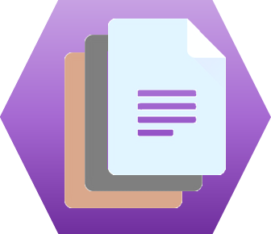

<span _ngcontent-xre-c122="" class="decentradocs">DecentraDocs</span> is composed of:
- an Angular Application (front-end)
- an Ethereum smart contract
- a NEAR Protocol smart contract

# Building the Angular application

This project was generated with [Angular CLI](https://github.com/angular/angular-cli) version 9.0.6.

## Install dependencies

```console
npm install
```

## Development server

Run `ng serve` for a dev server. Navigate to `http://localhost:4200/`. The app will automatically reload if you change any of the source files.

## Code scaffolding

Run `ng generate component component-name` to generate a new component. You can also use `ng generate directive|pipe|service|class|guard|interface|enum|module`.

## Build

Run `ng build` to build the project. The build artifacts will be stored in the `dist/` directory. Use the `--prod` flag for a production build.

## Running unit tests

Run `ng test` to execute the unit tests via [Karma](https://karma-runner.github.io).

## Running end-to-end tests

Run `ng e2e` to execute the end-to-end tests via [Protractor](http://www.protractortest.org/).

## Deploy on firebase

```console
npm install -g firebase-tools
```
```console
firebase login
```
```console
firebase init
```
```console
ng build --prod
```
```console
firebase deploy
```

## Further help

To get more help on the Angular CLI use `ng help` or go check out the [Angular CLI README](https://github.com/angular/angular-cli/blob/master/README.md).

# Building the Ethereum smart contract

## Install dependencies

```console
npm install
```
 ## Compile contracts
 ```console
 truffle compile
 ```
 ## Local Tests
### Ganache
* install and launch Ganache

* configure workspace:
  * Network ID = 5777
  * RPC Server = http://127.0.0.1:7545

### Contracts Unit tests
```console
 truffle test
 ```

### Local contracts deployment (on Ganache)
* Run Ganache
```console
 truffle migrate
```
 For further deployments (updates), use:
```console
 truffle migrate --reset
```

### Local integration tests

Once you have deployed contracts locally,
* Run front-end and open it in browser.
* Configure Metamask extension to connect Ganache workspace
* Select an account

## Deployment on Testnet (Ropsten)

Get Infura account and set INFURA_URI environnement variable

Example:
```code
set INFURA_URI=https://ropsten.infura.io/v3/9ac45e6f5a124874d1c2f47e545f1c4a
```
Create a wallet with Metamask and set MNEMONIC environnement variable

Example:
```code
set MNEMONIC=lion tiger house plane visitor care policy ...
```

You will need to pay for the contract creation fees.

Be sure the 1st account of this wallet owns a few ETH (>0.05 ETH) on Ropsten (get Ethers using a Ropsten Ethereum Faucet: for instance https://faucet.metamask.io).

```console
truffle migrate --reset --network ropsten
```

# Building the NEAR Protocol smart contract

Near Protocol smart contract is managed in the following repository:
https://github.com/levalleux-ludo/near.decentradocs


