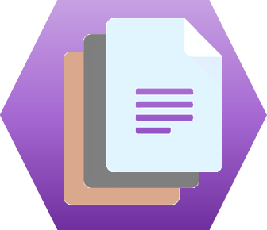

# DecentraDocs

# Welcome to

## What is DecentraDocs?

DecentraDocs is a decentralized, application (dAPP) providing a “cloud” opened platform that enables people and organizations to store, share, market and manage all kind of documents in the “PermaWeb”.

In some ways, DecentraDocs could be seen as a World-Wide Library.

## What is the **"Permaweb"**?

Build on top of the [Arweave network](https://www.arweave.org/#arweave-intro), the **permaweb** is “a global, community-owned web that anyone can contribute to or get paid to maintain.

The **permaweb** looks just like the normal web, but all of its content – from images to full web apps – is permanent, retrieved quickly, and decentralized – forever. Just as the first web connected people over vast distances, the **permaweb** connects people over extremely long periods of time.”

It means the document stored with DecentraDocs will stay available forever, for every user allowed to access it, without running cost (storage costs are paid upfront, for 100+ years!), without risk of loss, tampering or censorship.

## What does **_decentralized_** mean?

While a traditional storage server may fail, can tamper stored information (intentionally or not) or can deny access, the decentralized storage solutions run without any central authority or single point of failure offering, by design: **resilience**, **immutability**, **censorship resistance** and **openness**.

However, the consensus protocol on the decentralized networks provides a trustless mechanism to certify **authenticity** of the stored information.

## Yet another _cloud storage service_? So what?

DecentraDocs is built on top of:

*   the [Arweave network](https://www.arweave.org/#arweave-intro) providing the storage platform for managed documents (permaweb)
*   a couple of smart contracts (available on both [Ethereum](https://ethereum.org) or [NEAR Protocol](https://nearprotocol.com) blockchains): providing the document access control and subscription features

Hence, it’s not only a world-wide shared hard drive and is quite different from the usual “cloud storage service”, in 2 main aspects:

1.  First, because the decentralized architecture guarantees the provided services and specifications don’t rely on any third-party or central authority
2.  Secondly, because this architecture also provides exclusive document management services like:
    *   ### Version Control

        

        Each time you make a change in a document, then you update your publication in DecentraDocs, a **new version** of your document will be created

        Every version of your document remains accessible forever, hence you have a complete tracability of your document history

        
    *   ### Search Engine and Proof of Authenticty (PoA)

        The **Search Engine** allow to search per:
        *   author
        *   keyword in title
        *   keyword in description

        The **Doc Checker** allows to search in the Library if a given document already exists.

        This feature is very useful when your document has been copied to be shared with others: Given a copy, the doc checker retrieve which publication and which version it corresponds to.

        

        The Doc Checker can also be used to **certify the authenticity** of any document.

        
    *   ### Access Control

        

        When a document is published, the following option are available:

        *   #### Public

            The document can be downloaded by any user

        *   #### Restricted

            The document can be downloaded only by permissionned users

        After a restricted document is published, the author can still update the authorizations to allow/deny some users.

        When permission is granted to a user for a given document, it applies to all versions (past and future).

    *   ### Subscription/Monetization Services

        

        A restricted document can also be monetized: the author set the price for users to pay if they want to download the publication.

        When a user has subscribed to a given document, it applies to all versions (past and future).

## Why should I need to use DecentraDocs?

Whatever if you’re an individual or an organization, DecentraDocs is very useful as soon as you’re interested in:

*   Storing (and share) documents forever,
*   Keeping track of each version,
*   Setting up a subscription process for customers to access your publications,
*   Monetizing your publications,
*   Authentify/certifying any copy of a document.

Here is a non-exhaustive list of what you can (should) manage in DecentraDocs:

*   Office templates
*   Images
*   Music sheets
*   Artworks
*   Food recipes
*   Product datasheets
*   E-books
*   Regulations
*   Accounting reports
*   KPI reports
*   …

## How much does it cost?

Blockchain networks need contributions from users in order to work and last in the long term. That’s why there are a few fees when performing transactions.

Here are the fees associated with common actions in DecentraDocs:

<table _ngcontent-xre-c122="" border="1" cellpadding="10">

<tbody>

<tr _ngcontent-xre-c122="">

<th _ngcontent-xre-c122="">User Role</th>

<th _ngcontent-xre-c122="">Action</th>

<th _ngcontent-xre-c122="">Fees</th>

</tr>

<tr _ngcontent-xre-c122="">

<td _ngcontent-xre-c122="">Document Publisher</td>

<td _ngcontent-xre-c122="">Publish a Document (1st version)</td>

<td _ngcontent-xre-c122="">Arweave gas + Eth/Near gas</td>

</tr>

<tr _ngcontent-xre-c122="">

<td _ngcontent-xre-c122="">Document Publisher</td>

<td _ngcontent-xre-c122="">Publish a new version of a Document</td>

<td _ngcontent-xre-c122="">Arweave gas</td>

</tr>

<tr _ngcontent-xre-c122="">

<td _ngcontent-xre-c122="">Document Publisher</td>

<td _ngcontent-xre-c122="">Change Access Control rules</td>

<td _ngcontent-xre-c122="">Eth/Near gas</td>

</tr>

<tr _ngcontent-xre-c122="">

<td _ngcontent-xre-c122="">Reader</td>

<td _ngcontent-xre-c122="">Browse over documents in Global Library</td>

<td _ngcontent-xre-c122="">no fee</td>

</tr>

<tr _ngcontent-xre-c122="">

<td _ngcontent-xre-c122="">Reader</td>

<td _ngcontent-xre-c122="">Download a given version of a document (assuming the user is authorized or the document is public)</td>

<td _ngcontent-xre-c122="">no fee</td>

</tr>

<tr _ngcontent-xre-c122="">

<td _ngcontent-xre-c122="">Reader</td>

<td _ngcontent-xre-c122="">Subscribe to a Document</td>

<td _ngcontent-xre-c122="">Eth/Near gas</td>

</tr>

</tbody>

</table>

## What would DecentraDocs feature later?

DecentraDocs is only on its early stage. Here is a list of features that could be added next:

*   Dedicated fungible token to manage subscription fees
*   Dedicated non-fungible token to manage access control
*   Categories of documents to classify in library (for instance: ‘regulations’, ‘food recipes’, ‘templates’, …)
*   Folders (gathering a list of documents), allowing a reader to subscribe to the folder itself
*   Multi-authoring (or delegation)
*   Rating/reviews of publications from subscribers
*   Notification system (for instance, when a new version is available)
*   Document Signing/Approval process
*   Diff viewer (between 2 versions)
*   Advanced Document Workflows
*   …

## Try DecentraDocs now!

### [Demo 1](https://decentradocs.web.app/)

### [Demo 2](https://decentradocs.levalleuxludo.now.sh/)

## BUIDL IT

See [BUIDL.md](BUIDL.md)

# Credits
thanks to https://www.browserling.com/tools/html-to-markdown for generating this file from HTML

